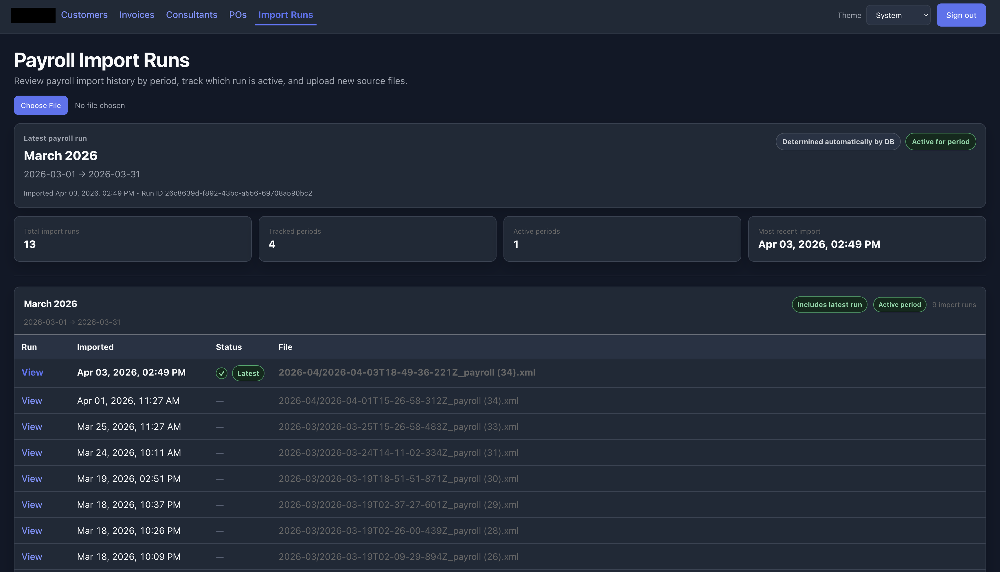
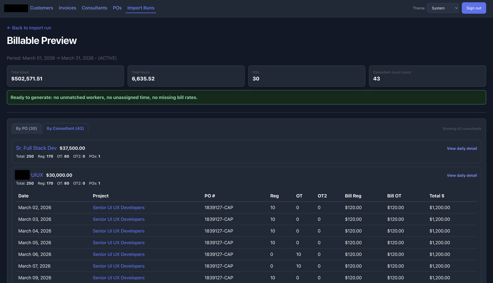
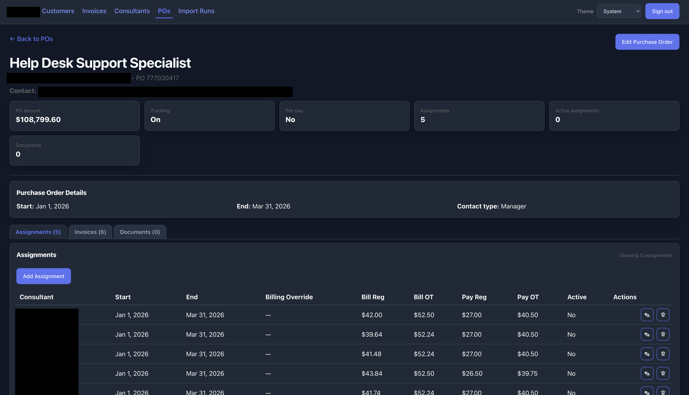
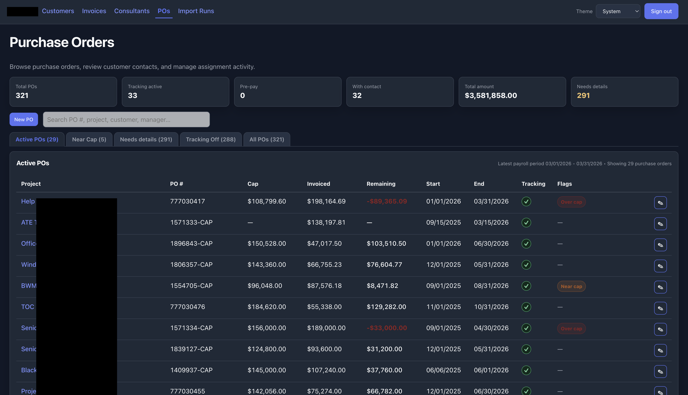

# Staffing Ops Platform

Internal staffing operations system built to support invoice automation, consultant tracking, purchase order management, payroll import processing, and billing workflow visibility.

## Overview

This project was created around a staffing business use case where key workflows were spread across disconnected records, manual reconciliation steps, and operational handoffs between payroll, consultant assignments, purchase orders, and invoice support processes.

The system brings those workflows into a more structured operating layer using a React front end, Supabase/Postgres data model, SQL-based schema design, and Edge Functions for backend automation.

## What the system does

- Tracks consultants, customers, assignments, and purchase orders
- Supports invoice-related workflow visibility and operational structure
- Imports payroll XML files into normalized records
- Reconciles imported worker data against consultant records
- Flags unmatched payroll records for review
- Connects payroll-related inputs to downstream billing workflows

## My role

I designed the workflow structure, relational data model, and business logic for this system, then used AI-assisted development to accelerate implementation across the React front end, Supabase schema, SQL objects, and Edge Functions.

My focus was not just writing code, but turning messy back-office processes into structured software that could support real operational use.

## Tech stack

- React
- Vite
- Supabase
- PostgreSQL
- Supabase Edge Functions
- SQL
- XML parsing
- AI-assisted development

## Repository structure

```text
app/                  React application source
docs/                 Architecture notes and screenshots
supabase/schema/      Curated database schema
supabase/functions/   Representative Edge Functions
```

## Included showcase components

### React application
The `app/` folder contains the front-end application used to manage core staffing operations workflows.

### Curated schema
The `supabase/schema/application-schema.sql` file contains a curated schema export focused on the application-specific database design.

### Edge Functions
The `supabase/functions/` folder contains representative backend automation logic. The included payroll XML import function demonstrates authentication, file processing, XML parsing, deduplication, record normalization, consultant matching, and unmatched exception handling.

## Screenshots

### Payroll import runs


### Billable preview


### Purchase order details


### Purchase orders overview


## Notes

This repository is presented as a curated portfolio case study. Some naming, structure, and contents have been simplified or generalized for public sharing.
